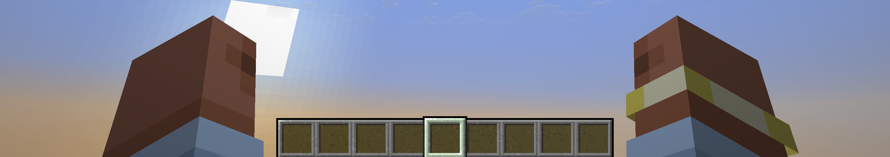

# SimpleOffhand

让第一人称下的空副手也显示出手臂，正如在愚人节版本 `22w13oneblockatatime` 中一样。

**中文** | [English](#english)

---

## 中文

### 效果

原版第一人称只会渲染主手。当副手为空，副手手臂是**完全不渲染**的 —— 这也是为什么会出现这个mod。

装上这个模组后，副手为空时也会渲染副手手臂画出来。

特殊情况：**主手拿着地图**时，原版渲染主手的方法变成（`renderTwoHandedMap`），这时会额外渲染出副手手臂。所以这时候保持原版行为，不再额外补一条手臂。这个"例外物品"的列表可以在配置里改。



### 环境要求

| 项目 | 版本 |
| --- | --- |
| Minecraft | 1.20.4（`minecraft_version_range=[1.20.4]`） |
| NeoForge | 20.4.251（loader `4+`） |
| 安装端 | **仅客户端** |
| 许可证 | MIT |

### 安装

1. 给客户端安装对应版本的 NeoForge；
2. 把构建出来的 `simpleoffhand-<版本>.jar` 放进 `.minecraft/mods/`；
3. 启动游戏。

这是纯客户端模组，只改第一人称手部的渲染，**服务器不需要安装**。

### 配置

配置文件位于 `config/simpleoffhand-client.toml`。游戏内从「模组列表 → SimpleOffhand → 配置」打开。

> **注意：1.20.6 / 1.20.4 两条支线的配置界面是本模组手写的。**
> 这两条线的 NeoForge **没有提供任何配置界面实现**（jar 里只有接口，没有实现类；
> `ConfigurationScreen` 要到 NeoForge 21.1 才有），所以界面只能自己画。
> 1.21.x / 26.x 那几条线用的是官方内置的 `ConfigurationScreen`，不受此影响。

| 配置项 | 默认值 | 说明 |
| --- | --- | --- |
| `modEnabled` | `true` | 模组总开关。关掉后第一人称手部完全按原版渲染。 |
| `twoHandedItems` | `["minecraft:filled_map"]` | 「双手物品」列表。主手持有这些物品时不再补画副手手臂，保持原版表现。每一项写成 `命名空间:路径`。 |

例如：想让主手拿盾牌时也保持原版行为：

```toml
twoHandedItems = ["minecraft:filled_map", "minecraft:shield"]
```

### 从源码构建

需要 JDK 17。

```bash
./gradlew build
```

产物在 `build/libs/`。开发时用 `./gradlew runClient` 直接启动客户端。

### 实现方式

用一个 Mixin 挂在 `FirstPersonHandsAndItemsRenderer#submitArmWithItem` 上（1.20.4 把原来的 `ItemInHandRenderer` 重构成了这个类，参数也从 player 实体改成了 render state）。原版的空手分支是：

```java
if (itemStack.isEmpty()) {
    if (isMainHand && !player.isInvisible()) {   // ← 只有主手才画
        this.renderPlayerArm(...);
    }
}
```

模组只补上「副手 + 空手」这一种原版没画的情况，其余分支（手持物品、弩、地图、挥手动画等）原样交回原版处理。

### 相关项目

1.21 及更早版本上的同类模组：Visible Offhand。

### 多版本

仓库按 MC 版本分分支，`master` 跟随最新版。分支列表、各版本坐标与技术差异见
[docs/VERSIONING.md](docs/VERSIONING.md)。

---

## English

### What it does

In vanilla first person, only the main hand is rendered. When the offhand slot is empty, the offhand arm is **not rendered at all** — which is why this mod exists.

With this mod installed, the offhand arm is rendered when the offhand slot is empty.

Special case: **when a map is held in the main hand**, vanilla's main-hand rendering path becomes (`renderTwoHandedMap`), which renders the offhand arm as well. So vanilla behaviour is kept here and no extra arm is drawn. The list of these items can be changed in the config.

### Requirements

| | |
| --- | --- |
| Minecraft | 1.20.4 (`minecraft_version_range=[1.20.4]`) |
| NeoForge | 20.4.251 (loader `4+`) |
| Side | **Client only** |
| License | MIT |

### Installation

1. Install NeoForge for your client;
2. Drop `simpleoffhand-<version>.jar` into `.minecraft/mods/`;
3. Launch the game.

This is a client-side mod that only changes first-person hand rendering — the server does **not** need it.

### Configuration

The config file is `config/simpleoffhand-client.toml`. In game, open it from *Mods → SimpleOffhand → Config*.

> **Note: on the 1.20.6 / 1.20.4 branches the config screen is hand-written by this mod.**
> NeoForge ships no config screen implementation for those versions (their jars only contain the
> interface, not an implementation; `ConfigurationScreen` only exists from NeoForge 21.1 onward),
> so the screen had to be drawn from scratch. The 1.21.x / 26.x branches use the built-in
> `ConfigurationScreen` and are unaffected.

| Option | Default | Description |
| --- | --- | --- |
| `modEnabled` | `true` | Master switch. When off, first-person hands render exactly like vanilla. |
| `twoHandedItems` | `["minecraft:filled_map"]` | Item IDs that keep vanilla behaviour while held in the main hand. Each entry uses `namespace:path`. |

### Building

Requires JDK 17.

```bash
./gradlew build
```

The jar lands in `build/libs/`. Use `./gradlew runClient` for development.

### Multi-version branches

One branch per MC version, `master` tracking the latest. See
[docs/VERSIONING.md](docs/VERSIONING.md) for the branch list, NeoForge coordinates and
per-version differences.

### License

[MIT](LICENSE)
